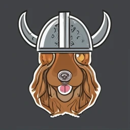

<h1 align="center">The Odin Companion</h1>

    

    <a href="https://the-odin-companion.vercel.app/" style="font-size: 24px;">Click here to visit the app!</a>

## Overview:

A pre-populated, ready to go flashcard system that learners of The Odin Project can easily use for practice to help master the material. The flashcard questions are based off lesson's ["Knowledge Checks."](https://www.theodinproject.com/lessons/node-path-javascript-objects-and-object-constructors#knowledge-check)

## Preview:

    

